# Finances 7 - Team Number 21

### Members: 
- Kalem Edlin ( edlinkale ) edlinkale@ecs.vuw.ac.nz
- Ghattas Farah ( farahghat ) farahghat@ecs.vuw.ac.nz
- Nicola Hallberg ( hallbenico ) hallbenico@ecs.vuw.ac.nz
- Tomas Lieffering ( lieffetoma ) lieffetoma@ecs.vuw.ac.nz
- Josh Saxton ( saxtonjosh ) saxtonjosh@ecs.vuw.ac.nz
- Brandon Williams ( williabran ) williabran@ecs.vuw.ac.nz

## Project Background:

#### Situation:

Students need to be able to effectively manage their finances. Students often live without strong financial security while studying, often leading to stressful financial situations . A student living in a rented flat will be expected to pay for rent, food, power and internet, as well as various other expenses that occur in shared living, such as buying shared flat products and subscription services. These expenses have to be paid out of student loan/ allowance payments and part time work, often meaning not much money is left over for emergencies or a rainy day. This financial pressure leads to decreased performance in study and often demotivates students in their academic pursuits.

Shared living can aggravate these financial pressures as it can be difficult to track what is owed and who is owed to, especially where small owings add up over time, leaving some flatmates greatly in debt to another without any real way of telling. Situations like these can become worse when one flatmate is in charge of rent or power payments, where the quality of life in the flat is placed in one person's hand. Shared living also makes it difficult to allocate responsibility for financial events, such as an internet payment. If no one is directly responsible for such financial events, often payment dates can come up unexpectedly, and the flat is faced with a loss of power, no internet and large bills that no flatmates are able to pay.

Students that are flatting thus need a centralised way of managing flat finances where they can easily track what is owed and who it is owed too. This process must be transparent and trustworthy so that all members of the flat can be sure of transactions. The system must be very easy to operate to encourage consistent use, even with small transactions. The system must support good financial decisions and allow for flatting students to track when and who they need to pay.

#### Existing Solutions

##### SplitWise  

SplitWise is an IOS and Android app that allows a group of renters to “keep track of [their]
shared expenses and balances with housemates, trips, groups, friends and family”. This app
covers a lot of bases within the flat finance management market such as creating groups for
finance tracking, splitting expenses by many helpful factors, facilitating transactions between
flatmates using Venmo and Paypal, recording debts (a nice ‘I owe you’ friends list interface),
suggested payments, recurring expenses, graph summaries of expenses and tracking
payments from the past. SplitWise also offers a “whiteboard” feature where members of the
group can leave notes or messages to the other flatmates to be seen when they check the
app.

##### Tricount 

Tricount is an IOS and Android app much like SplitWise but its differential factors are it does
not facilitate payments between flatmates. Instead, it does number conversions between
currencies and expense splitting that provide solid values that are owed and required to be
paid (shown to all flatmates, so they know that these payments have to be made) until both
parties confirm payment is made. Tricount does not offer as intuitive a design and user
process as SplitWise does.

##### Venmo 

Venmo facilitates monetary transactions between friends and connections in an easy and
social way. They offer a function to request money from connections and give money to
connections. This is done through smart technology like in person QR code scanning and
social network friend list integration. This app can be used as a ‘I owe you’ meaning its users
can request money from others, given their own expenses calculations, and it be kept as a
request until the recipient pays the balance. With an on to it head tenant, Venmo could be
used as a smart way to handle payments and inter-flatmate expenses.

##### Mint 

Mint is a budget planner that allows the user to categorize their expenses without having to
use spreadsheets in an easy and intuitive way. This helps the user to monitor past, present,
and future expenses and helps them to be on top of their finances as money comes and goes.
This could be used by a head-tenant to plan and ensure payments in conjunction with an app
like Venmo which facilitates payments and debts.

#### Business Objectives

Currently, it is up to the head-tenant of a flat to organize payments when bill and rent
payments come in and facilitate individual flatmate expenses when essential flat items are
purchased. It is important that rent and bills are paid on time so as to keep living in a flat
drama free as a home should be. Flatmates need a way of knowing when to pay their costs,
and to be compensated for items they may need to purchase. A head tenant needs a way of
letting the flatmates know when they are to compensate him for purchases and pay bills to
the flat account. The Flat Finance Management System (FFMS) must facilitate these Flat
Finance Management (FFM) requirements. The FFMS will save flat mates and head tenants
time and effort allowing them to focus on their other jobs and tasks that are inherently more
important to their careers. The income of tenants comes from work and study loan payments.
In order to make their income, they cannot afford to waste time on unnecessarily
communicating and organizing flat expenses that a FFMS could simplify greatly.

Considering this, the key objectives of the FFMS are:

1. Intuitive and simple design for interactions by users who are not greatly invested in
managing expenses.
2. Alert flatmates of payments for bills, rent and expenses to reduce flatmate stress and
conflicts.
3. Make the payments to the respective providers easier for the head tenant to facilitate.

#### Importance to Stake Holders

The FFMS is vital to maintaining a healthy relationship between flatmates preventing any
conflict by making sure less proactive flatmates pay their bills on time and accept
responsibility when it comes to flat necessities. It is the key to fostering a cosy home by
ensuring all utilities are paid for and that everyone gets along well without financial
miscommunication between the head tenant, flatmates, and even service providers. Because
the flatmates all play a vital part in FFM, the FFMS must be quick and easy to use to maximise
their time in other aspects of their life that are vital to their future.

# Personas: 

##### _Jack Davidson:_

|   ||
|---|---|
| Description             | Jack is a 21 year old domestic student who is in his third year of a Bachelor’s of Commerce at Victoria University. Jack lives with three of his friends  Jack enjoys a student lifestyle, and likes to enjoy himself on the weekend. He is social and plays football for a university team. He values being close to university and the city, so often finds himself paying for expensive rent prices and commodities. He is hard working, but does not stress over small things and has an easy go lucky attitude. He works part time as a waiter in a  restaurant in town to supplement his finances. Jack's financial goals are not too strict, he would rather enjoy his time at university without worrying about a student loan debt or savings. As long as he can pay for everything he needs he is happy.|
| Activities              | Jack spends his spare time socialising and with friends, though he will try to be sure to be caught up with studies before this. He spends his weekend playing for his football team, going to parties and working at his part time job.|
| Attitudes               | Jack does not get stressed by small things and is often very optimistic about potentially stressful situations.|
| Aptitudes               | Jack is hard working and will always put his best into what he does. This sets him up well for good results in what he does.|
| Weaknesses              | Jack can often be quite unorganised and sometimes has trouble prioritising what is more important for him to do.|
| Domain Knowledge        | Jack has a good understanding of finances from his learning in his degree and understands the importance of financial security.|
| System Knowledge        | Jack has never used a group finance manager before and has previously just paid as he went while flatting.|
| Interaction             | Jack will use the system for big payments such as rent or power, but will often let small payments pass.|
| Priorities              | Jack prioritises that everything is paid for rather than who exactly has paid for it. He would rather lose a small amount of money than make a fuss about it.|
| Motivations             | Jack will use the system to ensure everyone in his flat is in a good financial situation and that the flat can live well together.  He is not particularly concerned with saving but would rather finish his studies comfortably.|
| Computer self-efficacy  | Jack is comfortable doing simple everyday tasks on his phone but would rather do things face to face than through a screen.|
| Risk Tolerance          | Jack has a high risk tolerance and is happy to do things outside his comfort zone.|
| Information Processing  | Jack often breezes past information and would rather work things out for himself than read a tutorial.|
| Tinkering               | Jack does like to experiment with things but often finds himself without the proper knowledge to take it any further.|

##### George McDonald :

|   ||
|---|---|
| Description             |  George is a 20-year-old Kitchen Hand and 3rd year Animation and VFX Major at Victoria University of Wellington, living in a 4 person, musty but cosy flat in Aro Valley. His primary role as head tenant within the household is to ensure utility providers get paid when required and handle individual’s contribution costs. The only interfaces he uses to accomplish these tasks are his Gmail, Facebook Messenger group chats, a Google Doc/Calander, and his BNZ Online banking app to be alerted of, request, categorize, organize, and ensure payments are made from the right people to the right people. Georges’ goal for the flat is to make the place as cosy and friendly as possible for movie nights. Unfortunately, he cannot help becoming stressed and angry at other flatmates when they do not have good FFM. George’s life goal is to use these organizational skills in a creative career and to stay healthy and stress-free to achieve this goal. |
| Activities              |  George works at his job at night, and spends the rest of his time either sleeping, cooking, or studying trying to figure out how to animate and being creative |
| Attitudes               |  George is hot-headed and unforgiving. He will become stressed easily by others so in effort to prevent this, he tries to focus on his own tasks by converting them into easy to do steps.|
| Aptitudes               | George is driven when it comes to getting things done and will spend his time cramming without getting distracted until the job is complete.|
| Weaknesses              | He is not very patient. |
| Domain Knowledge        |  George knows what managing expenses is like to a personal and simple level from his time at boarding school |
| System Knowledge        | George has had 2 years’ experience on how to manage the expenses of an entire flats worth of people. |
| Interaction             |   George will interact with his set group of tools (multiple times a week) whenever he receives an email of a bill or notices the flat needs more essential items.|
| Priorities              | George wants to get his work done on time, make payments/purchases before they are due/needed, and stay calm while doing so without too many tedious distractions.|
| Motivations             | George is motivated by the flat’s cosiness and wants to keep it a homely and stressfree environment needing to keep a good relationship with his flatmates to maintain this, so he uses his flat finance management tools to make it as easy as he can for him and his flatmates, so as not to become sick of their potential ignorance of responsibility..|
| Computer self-efficacy  | George performs tasks within his set group of tools confidently and efficiently and when it comes to learning a new task, can figure it out over time due to his adaptability to new software for his degree.|
| Risk Tolerance          |  George has enough risk tolerance to let him try new systems to see if they work for him, but not enough to keep him from getting angry when things don’t work out after a while.|
| Information Processing  | George takes on small amounts of information when he thinks necessary, but prefers to tinker, until he knows how to do something.|
| Tinkering               |  He prefers to work through trial and error with little information gathered, thriving when it comes to experimenting, which can sometimes come as a detriment to his impatience. |

##### _Caitlin Fredicks:_

|   ||
|---|---|
| Description             | Caitlin is a 26 year domestic student who is now focusing on her Masters after finishing a Bachelor’s of Science, majoring in Biomedical Science. Caitlin has since done a gap year after finishing her Bachelor’s, and had been working full time in a pharmacy. Caitlin lives in a flat in the Lower Hutt where the rent is cheaper with a group of young professionals. Since finishing her Bachelor’s, she is now much more focused on saving money and trying to keep her student loan debts to a minimum. She enjoys socialising with friends but is equally comfortable having a quiet night in. She is now working part time as a retail assistant at a shoe store, and uses this money to supplement her student loan living cost. |
| Activities              | Caitlin spends a lot of her spare time reading and watching movies but enjoys socialising with friends every so often. She is also part of the university's squash club and regularly attends club events and tournaments. |
| Attitudes               | Caitlin can be pessimistic when under pressure, but maintains optimism when in a comfortable environment. |
| Aptitudes               | Caitlin is highly organised and works well in a structured environment.|
| Weaknesses              | Caitlin has trouble applying herself well in stressful situations, and finds herself easily distracted by things not relevant to her current endeavour.|
| Domain Knowledge        | Caitlin now has a lot of experience flatting and managing finances, but does not have much knowledge on more complex financial systems.|
| System Knowledge        | Caitlin has previously tried a group finance manager, but stopped using it as it did not correctly cater to her needs as a student|
| Interaction             | Caitlin will use the system even very small payments to ensure everyone in the flat is paying their fair share.|
| Priorities              | After working full time for a year, Caitlin values the money she earns and thus her priority is that she is not getting short changed by anyone in her flat.|
| Motivations             | Caitlin will use the system to ensure that everyone is paying their fair share. She is motivated by saving money and getting ahead on her finances.|
| Computer self-efficacy  | Caitlin has had some exposure to coding and more advanced computer uses through her degree and is comfortable doing these things.|
| Risk Tolerance          | Caitlin has a lower risk tolerance and would rather stay in her comfort zone.|
| Information Processing  | Caitlin processes information mostly by reading but is comfortable learning by doing. She will often read tutorials to get a basic understanding before working the rest out herself.|
| Tinkering               | Caitlin will mostly be content with using things as they are, but will tinker with things she is very knowledgeable about|

##### Jake Walters:

|   ||
|---|---|
| Description             |  Jake is a 19-year-old 2nd year Music Performance Major at Massey University, living with others he does not consider that close to him, in a room that is detached from the flat house in Wellington city. He is just a tenant and his primary role within the financial system is to make his payments on time, but only when asked. The only interfaces Jake uses to accomplish these tasks are Facebook Messenger group chats, and his Westpac Online banking app to be alerted of payments that are to be made to the head tenant when bills are due, or items are bought. He does not know what flat items are needed or when it is needed and will not ask in person. Jake’s goal for the flat is to have utilities without fail so that he can successfully create and produce music in his room without disruption. Jake’s life goal is to become a rich and famous musician but understands that he will need to spend money on important things, like flat expenses, to get there. |
| Activities              |  Jake spends his time in his room, practicing his instruments and playing loud music. He is not very easy to converse with in person but will spend a lot of time on social media on hisphone where he is easier to contact. |
| Attitudes               | Jake is lazy when it comes to how he lives his life. He is certainly pessimistic and will only work to prevent what he worries about if it is easy and readily accessible to him.. |
| Aptitudes               | Jake is driven and ambitious and will get his work done through long hours alone if they align with his goals|
| Weaknesses              | He is very reserved and not social enough to interact face to face with flatmates |
| Domain Knowledge        | Jake knows what consists of cost of living finances by always asking his parents about it when he lived at home.
| System Knowledge        | Jake has had little to no experience with flat finance management and is in need of a system that is intuitive and utilizes basic principles of finance that he can understand. |
| Interaction             |  Jake will interact with his flat finance tools (once a week) when he receives multiple urgent messages or a knock on the door from his head tenant.|
| Priorities              | Jake wants to become a musical virtuoso first and foremost, but will prioritize knowing about and getting the payments in just before they are due. He does not prioritize his relationship with his flatmates, but knows that he should work on pleasing them through finance and responsibility lest they kick him out.|
| Motivations             | Jake uses his flat finance management tools to keep bills in check because he knows if they are not paid, the ultimate consequence is him not being able to practice or make music in his room where he values being the most.|
| Computer self-efficacy  | Jake spends a lot of time pirating random software to use for his music production, and they all have different and weird user interfaces. Because of this, Jake is exceptionally good at performing varying tasks in a diverse range applications and using a new FFMS will hardly be a challenge|
| Risk Tolerance          | Jake has a high-risk tolerance as he oftentimes dives into applications without knowing what they do and will figure it out|
| Information Processing  | Jake is not one to take in information and will prefer to process his own findings through trial and error until he is completely familiar with a system.|
| Tinkering               | Jake is stubborn so he will spend hours trying to solve a problem and make something work purely through his actions on a system and will rarely look for outside help.|

##### Josh Murray:

|   ||
|---|---|
| Description             |  Josh is 18 years old, and a first year student at Victoria University of Wellington. He and 6 other friends have rented a 7-bedroom flat for the year. They are all first years, none of them having lived away from their family homes before. Between the 7 of them, they have decided to split the tasks of managing the finances - one person will be in charge of splitting the electricity, one in charge of rent, etc. Josh is looking to use a Finances Manager so that they can all ensure all of these tasks are being completed, and to have one place of finding all the expenses. Josh has a fair amount of free time outside of university, but he would much rather hang out with his friends than dedicate time to sorting out their finances. |
| Activities              |  Josh spends most of his time either at university or at his flat. He enjoys playing video games and football. |
| Attitudes               | Josh is easy going and laid back. He normally expects things to work out in the end. He is not overly organised but can get things done when he has to. |
| Aptitudes               | Josh is fairly good with technology, and is normally quick to learn new things.|
| Weaknesses              |Josh is a bit lazy - he likes things to work the first time. |
| Domain Knowledge        | Josh has never flatted before, so doesn't really know what to expect. |
| System Knowledge        | Josh has never used a finance manager before. |
| Interaction             |  Josh will check the finance manager when notified. This will likely be every one or two weeks.|
| Priorities              | Josh wants things to happen automatically, without user input. He doesn't want to have to micromanage every transaction.|
| Motivations             |  Josh wants to use a Finance Manager to control the chaos of 7 people controlling separate aspects of a flat's finances. He wants it to be very much hands-off, not requiring heavy admin work to set it up or maintain it.|
| Computer self-efficacy  | Josh is fairly confident with most technology, having used a variety of web and mobile apps in the past.|
| Risk Tolerance          | Josh is not very risk tolerant, as he does not have much experience with controlling his or others' finances. He will want complete confidence that he is doing something right before going through with it.|
| Information Processing  |  Josh tends towards a selective information processing style - he doesn't want to have read a lot of information to do the one task he wants to achieve.|
| Tinkering               | Josh wants to be able to determine how an experience works for himself, learning through use and not by paying attention to a tutorial.|

##### Édouard Dubois:

|   ||
|---|---|
| Description             |  Édouard is a 22-year-old international French student studying engineering at Victoria University of Wellington. He is currently undertaking his final year towards his Engineering degree. Over the past few years, Édouard has managed to save up to afford an apartment and is looking for some roommates to reduce overall living expenses. Édouard has experience with tracking his spending and finances however this is the first time he is dealing with expenses such as rates, insurance and receiving rent. His goals are to finish off his degree, move from an internship position to a full-time engineering role at the firm and save up to go on a holiday overseas. Edouard speaks primarly french and finds it difficult to understand english sometimes, so he prefers applications that allow a change in language so he can be comfortable with what he is doing |
| Activities              | Édouard is a little bit introverted and spends most of his time studying or working. He relaxes by working out at the gym and reading books in his downtime. |
| Attitudes               | Édouard can tend to be pessimistic and likes to know things well before he trusts them.|
| Aptitudes               | Édouard is very tenacious and will work hard to get what he wants. |
| Weaknesses              | His sometimes pessimistic attitude means he often does not try new things and misses out on important opportunities. |
| Domain Knowledge        | Édouard is comfortable managing his personal finances, but is concerned with how he can manage a shared financial situation like living with other people. |
| System Knowledge        | Édouard has never used a finance manager before and has always done things in his head. |
| Interaction             | Édouard will use the system regularly to ensure he is getting his fair share from the people he is living with. |
| Priorities              | Édouard wants to ensure that he is in a good financial situation when he leaves university and wants to ensure his money is not going to waste. |
| Motivations             |  Édouard wants to use the financial manager to help him and the people he is living with be in a good financial situation while flatting. |
| Computer self-efficacy  | Édouard is very good with technology through experience in his degree and is comfortable using and learning new systems. |
| Risk Tolerance          | Édouard will take risks in situations he is comfortable in, but tends to play it safe in unfamiliar situations.  |
| Information Processing  | Édouard processes information well and learns things quickly when there are good, clear instructions |
| Tinkering               | Édouard enjoys tinkering with things that he knows well, but prefers to do things as is in less familiar situations. |

The images for the personas where sourced from https://thispersondoesnotexist.com/

Coming into the group, there were quite a few Persona's that overlapped with each other. The main source for this was that a lot of the Persona's were based off our own or our friends experience. Because we are all part of a similar demographic, we all had similar ideas of what the typical user would look like. This was good as it concreted our belief of who the typical user would be, and we knew we were all on the same page regarding who would use this system. 

##### Typical User 

After discussion, we decided to include three personas of the typical user, these being Jack, Jake and Josh.  We felt as these personas best represented our typical user group, and gave a good range of different personalities you would find in a typical student flat. These where: "Regular student flatting and has no outstanding traits (Jack)", "Flatmate who strugglesto be on time for paying bills and other financial responsibilities (Jake)" and "Flatmate who is flatting for the first time (Josh)". By cementing these three personas as the typical users, we were able to better understand what the core functionality of the system needed to do, to provide these personas with solution they would be looking for. The reasoning for including these personas is dicussed further below:  

The first persona in this group of typical user is "Regular student who pays everything on time and has no outstanding traits (Jack)". The main reason for having this persona was that like all of us in the group that are flatting, as well as the majority of students who are flatting, we're in this position. Whilst it's nothing extraordinary and rather boring, it's still important that we keep the persona's realistic and take into account the perspective for what alot of all users would experience.

The second persona that came into the group was "Flatmate who struggles to be on time for paying bills and other financial responsibilities (Jake)". This persona was important for the group as this situation is generally the root cause for most failed flats. By understanding what this persona needs in order to be supported while flatting satisfies one of the key objectives of this system.

The third persona in this group is "Flatmate who is flatting for the first time (Josh)". This persona is important as we felt a lot of users would be in this group, and would want something to support them when they are trying to manage their finances independently for the first time. This persona allowed us to understand that the system must be simple and intuitive and not contain jargon that someone unfamiliar with finance would not understand.

##### Edge Case User

As for the remaining personas, we have included in personas that represent edge case uses. By combining each of the individual edge case personas, we feel as though we have a good range of edge cases that allowed us to expand the user demographic of the system.  The personas we chose are: "Older student not living with a group of friends, "Head tenant in the flat" and  "Student who speaks English as a second language". The reasoning for these is discussed further below:

The first persona in this group is "Older student not living with a group of friends (Caitlin)". We felt as though this persona was important as an older student may have a different relationship with their flatmates than a regular flatting group of friends might. This different relationship would change how finances are managed in the flat as each flatmate might not have the same level of trust with each other. This persona allowed us to understand how the system needed to be transparent to ensure the authenticity of payments made through the system. 

The second persona in this group was "Head tenant in the flat (George)". This was based on the experiences of members of the group who are currently flatting with a head tenant. We also had the idea of a "Live in landlord" persona but we chose this persona over it. The reason why we chose the "head tenant" as the persona was that we felt it would provide a more realistic situation of how some flats operate. As for why the "live in landlord" was merged, we felt that it was too similiar to the "head tenant" to make it it's own individual persona. Whilst it did have some good features which were merged into the final persona, most students and landlords wouldn't be in that situation. This persona is important as a flat operating like this may manage their finances differently and we felt as though accounting for this in the system was important for that group of people.

As for the last persona "Student who speak English as a second language (Édouard)", this was directly taken from one of the group members after realizing that everyone had overlooked a pertinent issue with our personas. It wasn't until we saw this persona that we realized we assumed all our persona's would be fluent in English and all of them would have grown up in New Zealand. Upon realizing this, we expanded on this persona from just being limited in the English language, but to also include them being from a different country where the culture in general is different to New Zealand, eg: Different tax system/how often payments occur. This persona is important as it takes into account accessibility issues alot of us overlooked in our designs. Through this persona, we were able to ammend our prototype to better include user's that speak English as a second language.

##### Learnings

These personas were choosen to expand the coverage of understanding regarding what our system needs to include to maximise the usability for a larger group of users. Merging these personas allowed us to get a much better understanding of who the users of this system might be and what we had each overlooked in our own designs. This understanding will allow us to create a more usuable solution for a larger group of users.

# Scenarios: 

Scenario: Submit New Invoice (_Requires Set Alert Times_)

Persona: George (Head Tenant)

| User Intention | System Responsibility |
|----------------|-----------------------|
|Open Head Tenant Menu | |
| | Display all head tenant activity options |
|Select option to submit new invoice | |
| | Request key invoice detail of invoice file/ email |
| Upload, foward or enter the details of the invoice | |
| | Register the invoice details into the flat group |
| | Request alert times for invoice reminders to the tenants |
| Select dates and times for the alerts to be sent | |
| | Request alert times to system calendar |
| | Display the invoice as an item on the flat calendar |
| | Split the costs evenly and display new debts on each tenants profile |

Scenario: Submit New Subscription (_Requires Set Alert Times_)

Persona: George (Head Tenant)

| User Intention | System Responsibility |
|----------------|-----------------------|
|Open Head Tenant Menu | |
| | Display all head tenant activity options |
|Select option to submit new subscription | |
| | Request subscription detail and frequency of recurring payment |
| Enter details of the subscription | |
| | Register the subscription details into the flat group |
| | Request alert times for subscription reminders to the tenants |
| Select dates and times for the alerts to be sent | |
| | Request alert times to system calendar |
| | Display the subscription as a recurring item on the flat calendar |
| | Split the costs evenly and display new debts on each tenants profile when the subscription payment is alerted |

Scenario: Make Payment (_Requires Authentication_)

Persona: All

| User Intention | System Responsibility |
|----------------|-----------------------|
|Open the debt dashboard for user profile | |
| | Display all types of debts and total debts |
|Select certain full debts based on their urgency, a specific amount for all or a single debt, or the total amount owed to all debts and select pay | |
| | Register the amount chosen and ask to confirm |
| Confirm the payment amount or restart | |
| | Provide a payment gateway to pay and authenticate user |
| Enter payment details and submit | |
| | Register payment made and send payment to flat account and/ or user to be compensated |
| | Update the debt of the user |
| |Alert the Head Tenant and/ or user to be compensated of payment being made |

Scenario: Request Item

Persona: All

| User Intention | System Responsibility |
|----------------|-----------------------|
|Open requested items menu | |
| | Display all requested items by most urgent |
| Select request new item | |
| | Display frequently requested items |
| | Ask for details of the item |
| Enter item urgency and the estimated cost or select from frequently requested items | |
| Enter payment details and submit | |
| | Register the item to all requested items display |
| | Send alert to tenants based on urgency |

Scenario: View Requested Item

Persona: All

| User Intention | System Responsibility |
|----------------|-----------------------|
|Open requested items menu | |
| | Display all requested item by most urgent |
| Select item of interest| |
| | Display the items urgency, estimated cost and the user that submitted the request |

Scenario: Request Compensation

Persona: All

| User Intention | System Responsibility |
|----------------|-----------------------|
|Open requested items menu | |
| | Display all requested item by most urgent |
| Select request compensation for item on display or select request compensation for new item| |
| | Ask for details of purchase and cost split selection |
| If not on the requested items list, enter details of item. Enter real cost and how to split among tenants | |
| | Remove item from requested items if existing | 
| | Add to frequently requested items if new |
| | Add selected debts to selected tenants |

Scenario: Create an Account

Persona: All

| User Intention | System Responsibility |
| --- | --- |
| Select Create account to start journey with the FFS system from homepage | |
| | Display account creation menu with options for details and a change language button if required, request account details in input bars |
| Enter details requested and then click create account | |
| | Show account edit confirmation page and give option to upload a profile picture, phone number and birthday |
| Upload a profile picture from device, and click confirm details | |
| | Store new user profile on the system, and redirect user to the home page |

Scenario: Request help for confidence on actions

Persona: Josh Murray

| User Intention | System Responsibility |
| --- | --- |
| With a lack of confidence on what exact values to enter in the request compensation menu, select the help icon | |
| | Direct user to the help center and display a list of frequently searched issues, and a search bar for a specific issue |
| Search a query with keywords &quot;compensation&quot; into the input bar | |
| | Show a list of documentation (instruction pages) for menus related to the search query prefix |
| Select an instruction element for viewing | |
| | Display a write up and user guide of instructions for how to use the request compensation menu step by step. |

Scenario: Set language to preferred language

Persona: Édouard Dubois:

| User Intention | System Responsibility |
| --- | --- |
| Be on login page ready to create an account, vaguely understanding the English on the page, and click change language | |
| | Display a list of flags to support user recognition of language regardless of words, and provide an option to search a language |
| Search in the search bar for a specific dialect of French that is preferred | |
| | Display a list of French flags with the names of French dialects available in the app, based on the search prefix &quot;French&quot; |
| Select the dialect and click continue | |
| | Set the local app settings to only display chosen language until user has created account, then set the account to the language chosen, so user can have same language on any device logged into. |

Scenario: Add New Tenant

Persona: George (Head Tenant)

| User Intention | System Responsibility |
|----------------|-----------------------|
|Open Head Tenant Menu | |
| | Display all head tenant activity options |
|Select option to add a new tenant | |
| | Request new tenant ID |
| Submit the ID received from communication with the new tenants, and the ID they got from their own account creation | |
| | Suggest modification of new tenant profile |
| Approve or edit and approve the new tenants profile content that they made on account creation | |
| | Add the new tenant profile to the flat group |
| | Adjust weightings of future cost split proportions |

Scenario: Dispute Payment

Persona: George (Head Tenant) and All Others

| User Intention | System Responsibility |
|----------------|-----------------------|
|Open the debt dashboard for user profile | |
| | Display all types of debts and total debts |
|Select a certain debt and select dispute | |
| | Ask user to submit explanation |
| Submit a reason and select the debt requestor | |
| | Send the payment dispute information to the Head Tenant and/ or the debt requestor(s) |

Scenario: Handle Dispute

Persona: George (Head Tenant) and All Others

| User Intention | System Responsibility |
|----------------|-----------------------|
|Select alert of payment dispute | |
| | Display the disputer and the debt requestor(s) |
| | Display the explanation from the disputer |
| | Display contact details from disputers profile |
| Contact disputer and resolve the issue | |
| | Request an action on the dispute |
| Either dismiss the dispute or alter the debts of the tenants as per resolution | |

Scenario: View Expense History Dashboard

Persona: All

| User Intention | System Responsibility |
|----------------|-----------------------|
|Open the debt dashboard menu for user profile | |
| | Display all types of debts and total debt |
| Select view expense history| |
| |Add the dashboard display of the flat expense history onto the end of personal debt dashboard |

Scenario: View Expense History Dashboard

Persona: All

| User Intention | System Responsibility |
|----------------|-----------------------|
|Open user profile menu | |
| | Display all information of the user |
| Select edit option| |
| | Make all information of the user editable |
| Submit changes to different aspects of the user profile | |
| | Register the updated values and update profile across flat group |

We decided as a group to base our prototype on Kalem's design from Assignment Two as we felt it had the best coverage of all our designs and had been more thoroughly designed. Because of this, many of the scenarios presented here are the same as in Kalem's Assignment Two. However, there have been some additional scenarios added in the areas that we decided were overlooked in Kalem's design. These added scenarios were decided on based on the heuristic evaluation we did on each other designs. We included the ones we felt where unique and included functionality that was overlooked by other members of the group. Some scenarios shown are specifically following the use case of personas created from the merge of personas like Josh Murray and foreign student Édouard Dubois. For example, Josh Murray is a confident doer and will only do an action if he is confident he is correct and the action is valid. A use case follows Josh as he gets stuck on a menu that he is not certain about and navigates to a help center to learn about the issue and be confident of his actions on the system. Another example is foreign student Édouard Dubois who speaks french as his primary language and the use case that follows him downloading the app, creating an account and having the option and expectation to change the language. Other use cases added follow group decisions on features wanted to be implemented based on design reviews like a login system and accoutn creation system.

# Design Ideation

Each groups memebers design can be viewed by following the links below:

[Tomas' Design](https://xd.adobe.com/view/9f00e4cf-6911-471b-b25d-75986e153dee-ca53/screen/e3840ea2-1e19-4895-96a8-d123997db09c)

[Brandon's Design](https://balsamiq.cloud/sqcxcg3/p4sc4lx)

[Ghattas' Design](https://xd.adobe.com/view/90ab46f0-25ac-4e63-a770-6d273b76dea9-c5f8/)

[Kalem's Design](https://xd.adobe.com/view/9b54b11d-1380-4df9-80b2-a31dfe8c6405-ce07/)

[Nicola's Design](https://xd.adobe.com/view/5d14a30a-c741-4416-a3bb-239e04468897-0847/?fullscreen)

[Josh's Design](https://balsamiq.cloud/sld2jnk/pcyn5lz)

# Design Review

Each group member reviewed another group member's, such that each group members design was reviewed once:

| Design  | Reviewed by |
| ------- | ----------- |
| Brandon | Nicola   |
| Nicola | Ghattas  |
| Ghattas | Kalem    |
| Kalem | Josh     |
| Josh   | Tomas    |
| Tomas  | Brandon  | 

We decided to use heuristic evaluation to review each other design. From doing these design reviews, we were able to identify problms and good features with each others designs.  The heuristics and details on issue review parameters to calculate issue importance used are shown below:

| Nielsen's Heuristics | Nielsen's Severity Rating | Rating | Impact |  Frequency | AVG
| --------------------------------- | ------------------------- | ------------------------- | ------------------------- | ------------------------- | ------------------------- |
| H1 - Visibility of system status  | 0	I don't agree that this is a usability problem at all | 0 Has lowest rating as an issue that needs thought | 0 Has little impact on usability | 0 -> n where n is the amount of times this issue is present| The calculated average of Severity, Rating, Impact, and Frequency; overall importance of issue|
| H2	Match between system and the real world	| 1	Cosmetic problem only: need not be fixed unless extra time is available on project | 1 Has low rating as an issue that needs thought | 1 Has some impact on usability |||
| H3	User control and freedom	| 2	Minor usability problem: fixing this should be given low priority | 2 Has a mid rating as an issue that needs thought | 2 Has moderate impact on usability |||
| H4	Consistency and standards	| 3	Major usability problem: important to fix, so should be given high priority | 3 Has a high rating as an issue t that needs thought |3 Has large impact on usability|||
| H5	Error prevention	| 4	Usability catastrophe: imperative to fix this before product can be released |  ||||
| H6	Recognition rather than recall |		|||||
| H7	Flexibility and efficiency of use |		|||||
| H8	Aesthetic and minimalist design |		|||||
| H9	Help users recognize, diagnose, and recover from errors |		|||||
| H10	Help and documentation ||||||
| |		|||||
| OI	Other issue	||||||

#### Brandon's review of Tomas' design

| Issue # |	Heuristic #	| Description | Rating | Freqency |	Severity | Impact |	Avg |
| ------- | ----------- | ----------- | ------ | -------- | -------- | ------ | --- |
| 1       | H1 | Everything seems alright | 0 | 0 | 0 | 0 | 0|
| 2       | H2 | Structure + colour looks similar to things you see in real life seems alright | 0 | 0 | 0 | 0 | 0|
| 3       | H3 | Quite a bit of hard control, think it might be a bit limiting with only yes/delete but not that much of an issue | 2 | 2 | 2 | 2 | 2|
| 4       | H4 | Seems similar/consistant to what you'd expect/see on a banking service etc | 0 | 0 | 0 | 0 | 0|
| 5       | H5 | Didn't see any final confirmation or formatting/error checking | 2 | 2 | 1 | 3 | 2|
| 6       | H6 | Home/creating seem very similar/only seems to be 2 pages ie: seeing group status and payment screen, if that's intended then nothing wrong/no problem | 1 | 1 | 1 | 1 | 1|
| 7       | H7 | Not sure if I saw anything that allowed for adding an expense to the flat for one off/reoccuring cost? | 2 | 2 | 2 | 2 | 2|
| 8       | H8 | Layout/menu seems fine and has the core essentials | 0 | 0 | 0 | 0 | 0|
| 9       | H9 | Seems easy to edit/readjust/cancel sections when creating since it's split up into its own thing but don't see anything that shows error prevention/errors | 1 | 1 | 1 | 1 | 1|
| 10      | H10| Don't see anything that shows help/tutorial for using the application, everything assumes we know everything and know how to navigate things/expects the user to explorer themself | 3 | 3 | 3 | 3 | 3|
	
##### Pros of design:

- Colour scheme is good/easy for the eye, 
- Menu is great, compact, does it job, easy to read/navigate
- Like that creating new things etc is split into sections and smaller secitons to allow deletation for parts but not the entire section.

##### Missing features:

- Think it's missing error message display/invalid entry
- Think it's missing Help/Tutorial featurer to display what's being shown, where and what button does/do/where to go
- Think its mising a language featurer that translates things on the application to specificed language
- Think it's missing the ability to add in one off/reoccuring expenses but I'm not 100% sure myself

#### Ghattas' review of Nicola's design

| Issue # |	Heuristic #	| Description | Rating | Freqency |	Severity | Impact |	Avg |
| ------- | ----------- | ----------- | ------ | -------- | -------- | ------ | --- |
| 1       | H1 | There’s no back button in ‘create a flat’ page | 3 | 3 | 2 | 3 | 2.75 |
| 2       | H8 | The home page is condensed | 1 | 0 | 1 | 1 | 0.75|
| 3       | H7 | Potential to add a confirmation button before adding a payment | 2 | 2 | 1 | 3 | 2 |

##### Features to consider:

- Really appealing and consistent colour scheme throughout the design	
- The calendar is a great feature to visualise the upcoming payments for the flat
- Contributors section was also good feature to see which flatmate is behind on paying shared bills.
- The upcoming payments page was also nice feature to manage and plan for upcoming payments.

#### Tomas' review of Josh's design

| Issue # |	Heuristic #	| Description | Rating | Freqency |	Severity | Impact |	Avg |
| ------- | ----------- | ----------- | ------ | -------- | -------- | ------ | --- |
| 1       | H7 | Most important information is not displayed very efficienctly on the home screen, users may miss important information | 3 | 4 | 2 | 2 | 2.75 |
| 2       | H3 | No prompts that encourages the user to scroll, user may miss information further down on the page | 2 | 3 | 2 | 2 | 2.25|
| 3       | H3 | User are forced to use a email to sign up, some user might not have it or might not want to use it | 2| 1 | 2 | 2 | 1.75 |
| 4       | H6 | Sidebar bar appears from the right side of the screen, not from the left like other apps, may confuse some user | 1 | 2 | 1 | 1 | 1.25 | 	
| 5       | H7 | Payment screen has alot of information packed into small space, making it difficult to find important functions | 3 | 2 | 2 | 2 |2.25 |
| 6       | H8 | Simple colour scheme can often make it difficult to differentiate sections on the screen | 2 | 3 | 2 | 3 |2.5 | 	
| 7      | H3 | Payment screen seems to lock the user into a prescribed way of using the system, not much freedom | 2 | 2 | 1 | 1 |1.5 | 
| 8      | H5 |Remove flatmate button is very big, could be easy to accidentlly press | 2 | 2 | 1 | 2 |1.75 | 		
| 9     | H5 |information first displayed to the user on the home screen maybe not the most useful information for the user| 2 | 2 | 1 | 2 |1.75 |

##### Pros of design

- Good simple colours scheme, green is a good choice for a money application.
- Large feature set that allows the users to access things in different ways.
- High amount of detail within the payment section, able to provide alot of detail about a payment.
- Includes alot of features relevant to student living.
- Inclusion of accessability option good.

#### Josh's review of Kalem's Design

| Issue # |	Heuristic #	| Description | Rating | Freqency |	Severity | Impact |	Avg |
| ------- | ----------- | ----------- | ------ | -------- | -------- | ------ | --- |
| 1       | H1 | Could possibly use small breadcrumbs between pages? | 0 | 1 | 0 | 0 | 0.3 |
| 2       | H2 | Payments to different accounts with 1 transaction? Not sure how this would work. | 3 | 2 | 4 | 3 | 3 |
| 3       | H3 | Parts of undo messages hard to read due to yellow highlight on white writing. | 3 | 3 | 2 | 1 | 2 |
| 4       | H7 | No walkthrough for first time users. | 2 | 1 | 2 | 2 | 1.7 | 	
| 5       | H9 | No showing of error messages in text boxes. | 2 | 2 | 2 | 2 | 2 |
| 6       | H10 | No help or feedback area. | 2 | 4 | 1 | 2 | 2.3 |
| 7	      | OI | Adding by student ID seems exclusive. | 2 | 1 | 2 | 2 | 1.7 |
| 8       | OI | Head tenant being the only one able to add invoices/subscriptions	| 2 | 2 | 1 | 3 | 2.0 |	

##### Pros/Features to consider for final product:

- Debt and dispute system great idea.
- Good use of visual loading bars showing status of pages.
- Good use of well known symbols and formats for menu's.
- Ability to undo actions or revert changes made.
- Overall consistent use of icons.
- Lots of clear error prevention messages.
- Each page usually only consists of 1 or 2 sub pages easy to remember where you are up to.
- Flexibility of use with the most frequently requested items streamlining the process of selecting items.
- Flexibility with the custom shortcuts on the home page, being able to prioritise things of importance to the user.
- Small number of things on the screen at once, not overloading short term memory.

##### Possible additions:

- Maybe have a ? icon at top right of each page that explains everything on the page.
- Could have a request invoice/subscription upload be accessible to all tenants, that the head tenant could then approve.

#### Nicola's review of Brandon's design

| Issue # |	Heuristic #	| Description | Rating | Freqency |	Severity | Impact |	Avg |
| ------- | ----------- | ----------- | ------ | -------- | -------- | ------ | --- |
| 1       | H1 | Page location isn't always explicit. Tabs at the bottom and back buttons track to some extent, but could possibly become unclear? | 2 | 3 | 2 | 2 | 2.25 |
| 2       | H5 | We could add confirmation messages? E.g. 'Are you sure?' before adding payments to prevent mistakes | 2 | 2 | 1 | 3 | 2|
| 3       | H7 | The design as it is only allows the user to create/edit the budget as a whole - the user would need to take a lot of steps to add/edit just one payment. This could be added as a shortcut? | 3 | 1 | 2 | 3 | 2.25 |
| 4       | H9 | Similar to above. I can't currently see a way for a user to delete just one payment from the budget? If they entered it wrong, they'd have to redo the whole budget | 3 | 2 | 3 | 3 | 2.75 | 			

##### Pros/Features to consider for final product:

- Pie chart with estimated budget for the month is a nice, clear way of viewing data + making predictions
- Option to manage personal spending vs. flat spending
- Pretty clear workflow around homepage/budgets/create a new budget. Simple and functional.

#### Kalem's review of Ghattas' design

| Issue # |	Heuristic #	| Description | Rating | Freqency |	Severity | Impact |	Avg |
| ------- | ----------- | ----------- | ------ | -------- | -------- | ------ | --- |
| 1       | H7 | Lack of icons or visible elements that enforce idea of “paying” in the make payment section. | 0 | 1 | 1 | 0 | 0.67 |
| 2       | OI | Visual alignment in summary window between elements of invite friends, add fixed weekly cost and recent activity do not align particularly well to support user flow. | 2 | 1 | 3 | 2 | 2|
| 3       | H4 | The stability and visual alignment of separate menus uses differing colour schemes in wireframe design (acknowledged design provides feature to make changes to this) and different layout styles EG curved and non-curved buttons/inputs are not too consistent among menus. | 2 | 3 | 2 | 1 | 2 |
| 4       | H1 | Lack of system status updates or confirmations that operations are being made. There are no loading bars, or confirmation popups to confirm the system has made or is making changes when a user interacts with it. | 2 | 4 | 1 | 1 | 2 | 	
| 5       | H2 | Matching Real world: Not sure how weekly costs and monthly costs are meant to be paid in payment window (could add payment amounts to confirm to user how much they owe in the payment menu). | 1 | 1 | 2 | 2 | 1.5 | 
| 6       | H10 | Lack of help icons or hints to how to use the program. | 3 | 6 | 2 | 1 | 3 | 		

##### Pros/Good heuristics to consider for final product:

- Design has helpful shortcut options at the bottom of the summary menu that can take users to “Create Group” menu, “Report Issue” menu and “Manage Costs” which are straight forward and easy to navigate with checking the Flexibility and Efficiency Heuristic by assisting expert users who must use the system a lot and making everything reachable in a few clicks and allows user to make a new group quickly.
- Good direct manipulation and action recognition in buttons that can lead the user. EG, the buttons “See issue board” and “Create Group” are buttons that contain verbs and are explicit actions. Whereas all objects pertain to nouns so as not to be confused for buttons.
- Great Aesthetic Integrity in buttons at bottom of summary menu, fixed cost menu and create group menu featuring buttons with specific icons and clean colour wheel options etc.
- Cool feature to edit colour scheme for entire program based on group made/chosen.
- Good error recovery by allowing user to report issues with program as it pertains to user decisions and how these decisions combine to make up the app functionality.
- Good match to real world with a lack of specific jargon (good actions names that are clear and easy to understand) and good alignment of buttons that are natural mappings of their functions and what they do.

##### Possible additions:

- Could have visible elements in the payment window that visible enforce the idea to user that they are making a payment and assist their understanding that making a payment is no small deal (for students).
- Could add payment amounts in payment window to give user an idea of what they owe, when having to submit an ammount

### **Prototype Updates**

- New Color element added that incorporates elements that were positively reacted to by group memebers 
(Kalem in Ghattas' design and Brandon in Thomas' design) who appreciated a gradient colour. The color
is a hybrid gradient of the two main color features in Kalem's design that the group as a whole agreed
would be the baseline design for the project.

- A login menu (welcome screen) with account creation was implemented in the prototype due to a lack of coverage of a typical
user journey of a new user. The account creation and login space also provides options for set up of the app
like language and profile details. The account creation and login feature was implemented due to the group
members having these systems in their designs (Josh and Ghattas) and apprecitating them in the design review sections.

- A bill dashboard was implemented in the prototype based on design combitations of the group memebers that
had a bill specific window (Josh and Nicola) to see bills in more detail than just the original design calander. This provides
more coverage across all of the members opinions of how a FFS app should function and how billing should have
more detail available as it is one of the most expensive parts of Flat finance.

- On top of a bill dashboard, an upcoming payments dashboard (like the debt dashboard, but for payments with certain due time)
was implemented based on Nicola's design as we agreed as a group that more urgency with payments was required and prefered.

- Change Langauge menu added to main side window navigation area. For someone who dosent prefer english as
the language of the app, the ability to change the language is available. Even if the persona does not
speak language at all, a change in language is only 2 clicks away through two intuative buttons; the 
universal 3 bar icon to show a dragable side menu (common in most apps) and within that side menu a
Globe style icon that universally represents a change in language menu. In the change in language menu,
there is an intuative scroll menu to select a language with icons to support a lack of undesrtanding
of the default language (english). The language change menu is also accessible from the login/create 
account menu with the same Globe icon leading to it, where the user will be able to change the language
before having to use the app at all. The user can choose from a country flag (visually) as a language,
or search their language up in the language search bar

- A distinct help button was added to all the menus (top right) that require value inputs, and interactions that are slightly more
advanced than the other menus in the design. This button is characterized by a question mark with a circle around it. The question
mark is a universal icon for help and knowledge when it is needed. This qeustion mark principle is also used on the debt dashboard
at the bottom where the user can get help too. It is also found in the side bar menu as "get help" with the question mark icon again.
All of the instances of "get help" and the question mark icon lead to a menu that is called the help center. Here a user can search
issues or topics in the query bar, select from commonly searched issues, or view the entire documentation directorty of the app for
more specific issues. This makes sure that users that need help with their actions and are not as much a tinker as other users, can
get informed and recieve explicit information for the issues that they encounter.

Other features implemented:
- Back buttons from every step (given little steps for each task taken by user) to the previous step or homepage
- An upload profile picture feature to the profile customization menu
- Custom shortcut links that actually lead to a menu
- More user friendly and user flow worthy buttons that exhibit more demanding color combinations based on warnings, successes and alerts

# Additions Group Reflection

#### Reflection on merging of the design:

The core/base for our group’s final prototype and reflection was chosen mostly on what we felt had the best/widest coverage as well as what the tutors supported/implied via the marks we got for the initial prototypes (assignment 2). With this approach, we selected Kalem’s design to the base for our final prototype.
 
Group reviewed each other's designs based on the brief of the project, however, we reviewed one design each allocating one design to each person to review as per the brief. We think it would have been more valuable for each group member to review all the group member’s designs to get more spread of opinions and more ideation about potential features for the prototype.
As a group, we decided to go with Kalem’s base design to build the prototype off of seeing as we informally went through its benefits compared to the other designs. It would have been valuable to each review Kalem’s design so that we could have more ideation over the design that would be going through to the final prototype, but instead, we have just integrated our informal improvements (from in-person meetings) into Kalem’s design. On top of these informal improvements discussed, we have also implemented features to the prototype based on pros from design reviews for the other designs to efficiently merge the designs and their best features into our base design (Kalem’s design). These issues were swayed by our work and communications style, being primarily through discord (with 2 in person meetings). With working online we have had instances of lost files within the text chat, forgetting discussed vocal ideas that were not physically written down (that we would have done in person) and not being able to make meetings due to technical issues and not being home to use computer etc.

Despite most of us having similar core/values in our initial design, we were able to extract small sections and features from other designs that weren’t implemented in Kalem’s design to improve the overall design. Examples of this were: pie charts being used as opposed to just listing expense. This was based on Brandon’s initial design as it was more visually appealing as opposed to just text. The ability to view upcoming payments was taken from Nichola’s design and used as it improved the user experience and directly displayed our solution for the initial problem that lead to this design being created. Lastly, the editing & deleting section was changed to be more like Tomas’s design as it provided better usability and allowed users to have a better experience compared to the initial design. A list of features that were under consideration as part of the merging can be found [here](https://gitlab.ecs.vuw.ac.nz/course-work/swen303/2021/project1/t21/swen303-project-prototype/-/blob/master/DesignReviews/Potental_featurers_to_implement_for_design.txt) with the pro's and con's for all designs found [here](https://gitlab.ecs.vuw.ac.nz/course-work/swen303/2021/project1/t21/swen303-project-prototype/-/tree/master/DesignReviews). 
 
Overall we felt that we were able to take some of the best parts from everyone’s design as well as change/improve aspects that we felt were lacking with the base design.
 
#### Best and worst parts of the prototype:
 
We believe that the best/strongest part of the prototype is the ability to see your overdue/immediate expenses as well as the ability to see upcoming expenses. We made sure that this would be the best part for the entire prototype as we believed this was the answer/solved the root problems that lead to budgeting applications being developed and used. Other parts of the prototype that we liked were the colour theme and pictures/icons used. Beside’s just looking good, the colour and image flow indirectly assists in the cognitive walkthrough ability for users.
 
Some immediate weaknesses regarding our final prototype would be the inability of users to customize/personalise the application. For example, users are unable to change the background (ie: light mode/dark mode), the overall colour theme, text size etc. This mainly came down to us not having enough time to implement them and viewing these as extra/additional features and widgets as opposed to a necessary feature like the translate button. 
 
Other weaknesses within the prototype were our inability/limitations for expanding on widgets, more specifically help options, and the language feature. The main problem for the language widget was we were unable to account for every language due to space and time limitations, but also countries with multiple languages/dialects. The primary example was China. China has two primary languages, “Mandarin” and ‘Cantonese”. Whilst technically both “Chinese”, they vary enough that they are considered to be similar, but different language. Since we want to follow with previous cognitive heuristics and we unable to think of any solutions within the time frame, we ended up removing the least popular language. If we were to revisit this/able to readjust features, we would try to think of a way to solve this problem or change how we display the initial language display.

The last/worst part regarding the prototype would be the “help” section. When we initially merged our prototypes, we had plans to make an elaborate help system that would teach/show what sections do and so on. However, we severely underestimated how complex and time consuming this would end up being. Examples of what was initially proposed can be found 
[here](https://imgur.com/a/l88GMLI) (Image 1 of "Help") and[ here](https://imgur.com/a/z40LEbp) (Image 2 of "Help").                        
What was initially meant to be an in-depth, key feature for the prototype ended up being a rushed “help” button that would take users to the “FAQ” page. It would have also been valuable to have the help buttons link directly to a help article on how to use the specific menu the button was clicked from. This way a user who is unsure of how to use a certain menu, says the dispute payment menu, can find a guide on how to use it and advice on when to use it too. Several factors such as time, an over-estimation of our abilities or simply an under-estimation of the task all contributed to this feature and is the “worst” section in this otherwise great prototype design.

All together, a lot of the "worst" parts of our final prototype is mainly just cosmetic/convenient functionality and doesn't affect the application's functionality or usability. Most of these probems can and could be fixed had we had just a little bit more time but overall, we're satisfied with everything else that exists on the prototype.

### **Usability Test Plan**

#### Methodology

We have decided to test our prototype with four individuals. The main
focus for this user testing is to trial our click-through prototype and
to understand what is working well in the prototype, what needs
attention and what has been overlooked. We are testing based on the
essential use cases specified above. We aim to assess the ease and
effectiveness of use when performing these essential use cases

#### Roles

During the testing, we each assumed a specific role to ensure testing
was thorough and gave the testers the most opportunity to experience
using the system and to give feedback. Kalem and Josh directed the
testing, reading the script to the testers and giving them instructions
to complete the given essential use cases. Brandon and Nicola took notes
regarding the comments made by the testers as they were completing the
use cases. Tomas and Ghattas then assisted the testers in any area where
they got stuck to ensure they were able to complete the given tasks.

#### **Tasks**

The tasks we are testing are based primarily on our essential use cases
as these provide good coverage for functions that the system needs to do
well in order to be useful. Also, because we are basing these tasks on
the essential use cases, it will be apparent what we have overlooked in
our design. We also added secondary tasks that the users would have to
perform to perform each essential use case, such as opening the
navigation bar.

We decided to split the tasks into two parts. The first half of the
tasks were general tasks that all users would experience, regardless of
their role. Tasks involving adding and disputing expenses, requesting
items and just overall usability were all tested.

The other half for tasks were more targeted based on specific roles. For
example, situations in which only the Head Tenant would be involved such
as solving disputes or editing the flat group. Additional tasks
involving multiple roles interacting were also trialled and tested. A
specific task based on this was a regular flatmate disputing an expense
request and the head tenant solving/having the final say on said
expense.

A full list of all tasks can be found in the next section.

#### **The Script**

##### **General task:**

1.  “Can you create an account?”

2.  “Can you log into your account?”

3.  “Can you view the flat calendar?”

4.  “Can Access navigation menu

5.  “Can you open the help menu?”

6.  “Can you edit your profile?”

7.  “Can you undo an action?”

##### **Head tenant tasks:**

1.  “Can you create a new invoice?”

2.  “Can you add a new flatmate?”

3.  “Can you check in on dispute status?”

4.  “Can you open the help menu?”

##### **Normal flatmate tasks:**

1.  “Can you make a payment?”

2.  “Can you make a dispute?”

3.  “Can you make a new request item?”

4.  “Can you make a new compensation request ?”

5.  “Can you open the help menu?”

##### **Foreign student tasks:**

1.  “Can you change language?”

2.  “Can you open the help menu?”

#### **Metrics**

Regarding metrics, we wanted to measure success based on these 6
criteria. These criteria give good coverage of different ways the system
can be usable or unusable.

1.  Can users instinctively navigate where to go for tasks without being
    > guided by us?

2.  Can users understand what’s happening on a specific page without
    > needing to be explained what it is/ does? (is it obvious what use
    > case each page performs?)

3.  Is the information on a page displayed effectively and in a
    > non-confusing manner?

4.  Is the positioning of elements on the page intuitive and easy to
    > access?

5.  How effectively could users complete their task?

6.  How effectively could users complete tasks that involved multiple
    > people?

#### **Usability Goals**

Regarding measurements from the metrics, we didn’t define success as a
numerical value, but rather what the general opinion/impression from the
users who tested it were. Going into testing, we have expectations for
each metric, what we expect user feedback and opinion should be for said
metric and its reasoning.

Regarding the first metric, we considered it successful if the user was
able to navigate to tasks specified without guidance. Even with limited
time spent in the application, students with minimal mobile banking
experience should be able to find things easily if our usability
heuristic ideas during the prototype phase were successful. We would be
happy if users were a little bit slow since this it’s a new application
and the first time using this sort of program for students. However, if
it does take too long, that would be an indication of bad design by us.

Similarly, users should also be able to easily identify where they are
and what the page does. For example, if the user was on the create a new
expense tab, they should be easily able to identify they are an expense
and not mistake it for something else like upcoming payments etc. We
feel that this was a very important matric as if users are lost, it’s
unlikely that they would continue using the application.

For the information and overall general presentation, our main baseline
for success was whether the users liked how information is portrayed and
whether this presentation made it obvious what the system would do.
Since style is subjective to each person, as long as there wasn’t
anything that stood out for all the testers who tested the prototype,
this would be considered successful.

Lastly, regarding testing itself, we based the matrics on how
effectively the user could complete tasks that we assigned them. For
this, we hold a high expectation and won’t accept anything less. As most
of the tasks are based on situations flats would encounter daily, it was
of utmost importance that the users who would use this application were
targeted for were able to do what they wanted as straight and direct as
possible. If users struggled to do tasks now in a controlled, relaxed
environment, they would likely fail using this with the chaoticness that
occurs in real life. Thus to ensure that the application is a success
and help solve the problem that leads to the creation of this project,
we would expect nothing less than perfection.

#### **Problem Severity**

##### **Low severity:**

This is a problem that is easy to fix and only slightly impedes the
usability of the system. A user experiencing this problem would still be
able to perform the task, but it may take them more than one attempt to
do it correctly. If this problem was to stay in the system, it would
still be usable.

##### **Medium severity:**

This problem may be harder to fix and impedes the overall usability of
the system. A user experiencing this problem would likely not understand
the task they are trying to complete, complete the task incorrectly or
give up on the task. If this problem were to stay in the system, it may
still be usable, but the system would not be able to be utilised to its
full functionality.

##### **High severity:**

This problem completely impedes the usability of the system. A user
experiencing this problem would not be able to complete the task
successfully and would most likely give up. If this problem was to stay
in the system, most users would not continue to use the system based on
this problem

### **User Testing Results**

#### **Issues found through testing:**

Given that our goals are not defined numerically, but are based on the
degree to which we feel the metrics are achieved, they are not
specifically linked to here. Once fixed, each issue improves the
metric/s it is related to and gets us close to the goal of "success" for
that metric.

-   **Calendar button:** On the homepage, the button to view the
    > calendar is quite small. Make it bigger to change it to something
    > clearer.

    -   Metrics: some of the testers needed hints to find the button to
        > open the calendar. They seemed to understand what both pages
        > were for without help. No issues with how it's displayed.
        > Fairly straightforward once the button was found.

    -   Problem severity: this is an important usability issue, but is
        > an easy fix.

<!-- -->

-   **Nav menu exit:** From the navigation menu, they noted that you
    > should be able to tap/swipe off the screen rather than needing to
    > tap the back button.

    -   Metrics: most of the testers tried to do this instinctively, so
        > it would be nice to include what the users already intuitively
        > want to do. Overall layout + information presented was
        > understood, the task is very straightforward.

    -   Problem severity: this is a minor, surface-level issue.
        > Improving it makes the system nicer but it functions without
        > it.

<!-- -->

-   **Confirmation colours:** On the confirmation screens ("are you
    > sure?"), they mentioned that it was slightly misleading that the
    > confirm buttons are yellow/orange. Maybe instead the "cancel"
    > button should be red?

    -   Metrics: Do the users like how the information is displayed?

    -   Problem severity: This is a medium-severity issue. Technically,
        > the app functions without it, but usability would be a lot
        > better once it's fixed.

<!-- -->

-   **Debt expand button:** On the Debt Dashboard page, the buttons to
    > expand a debt to make a dispute are very small. Either make them
    > bigger or allow users to click anywhere on the debt to expand.

    -   Metrics: Can users understand what’s happening on a specific
        > page without needing to be explained what it is/does? Do the
        > users like how the information is displayed?

    -   Problem severity: This is an important issue, as without it the
        > app is very hard to use.

<!-- -->

-   **Requested items page:** Requested items page is confusing. The
    > green tick leads to a new compensation request, should this lead
    > to an acceptance page? Also, the white tick on a green background
    > is hard to read on some devices - the green could be changed to a
    > darker colour so it doesn't become unclear on different screens.

    -   Metrics: Can users understand what’s happening on a specific
        > page without needing to be explained what it is/does? Do the
        > users like how the information is displayed?

    -   Problem severity: This is an important issue, and needs a bit of
        > work to fix. It was quite confusing to our users and is an
        > important function within our system.

<!-- -->

-   **Spelling:** Correct spelling of documentation on the help page

    -   Metrics: Do the users like how the information relative to the
        > task/page is displayed on the interface

    -   Problem severity: This is a minor issue, and can be fixed
        > easily.

<!-- -->

-   **Action history undo button:** On the action history page, change
    > the "refresh" icon beside each action to one that indicates
    > "undo".

    -   Metrics: Can users instinctively navigate where to go for tasks
        > without being guided by us?

    -   Problem severity: This is an important issue, it's quite
        > misleading and makes it unclear what the task is meant to be

<!-- -->

-   **Action history time:** Also on the action history page, make it
    > clear that the time for each action is the time left to undo that
    > action.

    -   Metrics: Can users understand what’s happening on a specific
        > page without needing to be explained what it is/does?

    -   Problem severity: This is of mid-range importance. Making this
        > clearer would make it more immediately obvious what is being
        > represented, but it is possible to use the system and learn
        > what this means without explanation. Fixing it just improves
        > the experience.

<!-- -->

-   **Home page arrows:** On the home page, clicking the arrows to the
    > pie chart and back causes arrows to change positions.

    -   Metrics: Do users like the layout overall excluding
        > text/information?

    -   Problem severity: This is a minor issue and a quick fix that
        > improves the consistency of the app.

<!-- -->

-   **FFM Logo:** On the navigation menu, clicking the FFM logo should
    > return the user to the home page.

    -   Metrics: Do the users like how the information relative to the
        > task/page is displayed on the interface.

    -   Problem severity: This is a minor issue, the app works without
        > it. Our users instinctively tried to do this, so it would be
        > nice to add it in.

<!-- -->

-   **Head tenant nav:** On the navigation menu, the "head tenant menu"
    > button seemed a little confusing to testers. Maybe it shouldn't be
    > any different from the other pages in the navigation menu? Also,
    > the white text on the orange was hard to read on some devices.

    -   Metrics: Do the users like how the information relative to the
        > task/page is displayed on the interface? Can users understand
        > what’s happening on a specific page without needing to be
        > explained what it is/does?

    -   Problem severity: This is an important issue. This is an
        > integral function of the app and it should be clear and easy
        > to use.

<!-- -->

-   **Home icon:** On the home page, should clicking on the house icon
    > take you somewhere? To a flat landing page where users can see
    > other flat members. The little "exit" icon below the home icon is
    > really small and goes nowhere. Maybe the option to leave the flat
    > exists on this flat landing page?

    -   Metrics: Do the users like how the information relative to the
        > task/page is displayed on the interface?

    -   Problem severity: This is a mid-range issue. It's not
        > functionality that will need to be used often, but the home
        > icon being on our home page means that it will often be
        > presented to the user and should do something meaningful.

<!-- -->

-   **New invoice vs subscription:** From the head tenant menu, the new
    > invoice vs new subscription is confusing. Maybe change it so that
    > it is a new one-off invoice vs a new recurring payment?

    -   Metrics: Can users understand what’s happening on a specific
        > page without needing to be explained what it is/does?

    -   Problem severity: This is an important issue. The wording of
        > this is very important as it sets us the functionality of the
        > whole app. A new user should be able to understand how to make
        > a one-off or a recurring payment, even if they have little
        > experience with finances.

<!-- -->

-   **New invoice alert times:** Within the new invoice/subscription,
    > the two alerts that you can set confused our testers. Add an
    > option to remove alert times, and make it more clear what the
    > alert time is on this page.

    -   Metrics: Do the users like how the information relative to the
        > task/page is displayed on the interface?

    -   Problem severity: This is a mid-range issue. Not fixing this
        > means this area is a little ambiguous but can be understood
        > after some use. It would be better to have a small explanation
        > or a different way of positioning this.

<!-- -->

-   **Buttons to nowhere:** Quite a few buttons lead to nowhere. We
    > probably can't have everything completely working, but there are a
    > couple places where you can get stuck as no buttons lead away from
    > it (e.g. requesting compensation, you can only accept and none of
    > the back buttons work)

    -   Metrics: How straightforward/quickly could users complete their
        > task?

    -   Problem severity: This is quite important, but is also limited
        > in our ability to fix it by the limitations of adobeXD and the
        > fact that this is merely a prototype. Not every link will be
        > able to be fully expandable in the time of this project, but
        > there are some more major places where fixing them helps to
        > clarify usability.

<!-- -->

-   **Success confirmation:** Add "success" pages after confirmation
    > pages. E.g once you've confirmed you want to make a payment/make a
    > request, then go to a "payment made successfully" page.

    -   Metrics: Do the users like how the information relative to the
        > task/page is displayed on the interface?

    -   Problem severity: This is a mid-range issue, it could help
        > assure a user the system is working properly, but the app does
        > function without it.

### **Prototype Updates**

#### **Confirmation colours**

On the confirmation screens, users mentioned that it was slightly
misleading that the confirm buttons are yellow/orange. Updated all
confirmation screens to have the cancel option in red to distinguish a
negative action “cancel” from the affirmative action. We considered the
concern from the tester about the orange button being misleading, but we
decided that we should leave the confirmation button orange as we
believe the philosophy of the use of orange still holds. The
justification here is that the orange color is supposed to represent a
significant action, and when a user sees an orange button, after some
use of the app, their brain will learn to see orange as a button for
taking a second to think about the action. We thought that the concern
was valid however and made the cancel buttons red to take away from the
confusion of the affirmative button being the only button colored. This
makes sure that the tester's concern is addressed by removing the
thought of orange meaning cancel, by adding a red button which is
obviously cancel, while still retaining the orange highlight color and
its main philosophy. This way it is clearer what each button does in
confirmation screens, meaning less unintended actions occurring.

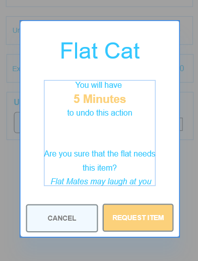

#### **Colour Scheme/Requested items menu**

Some of the feedback from testing was about how the lighter colours of
green and yellow in the colour scheme made some symbols and words
difficult to see/read so we decided to change the global colours
associated with these buttons/words that were hard to see making them
easier to see this fixed the issue across the whole application.

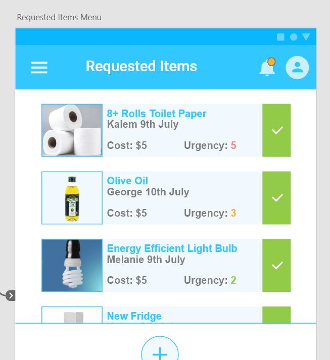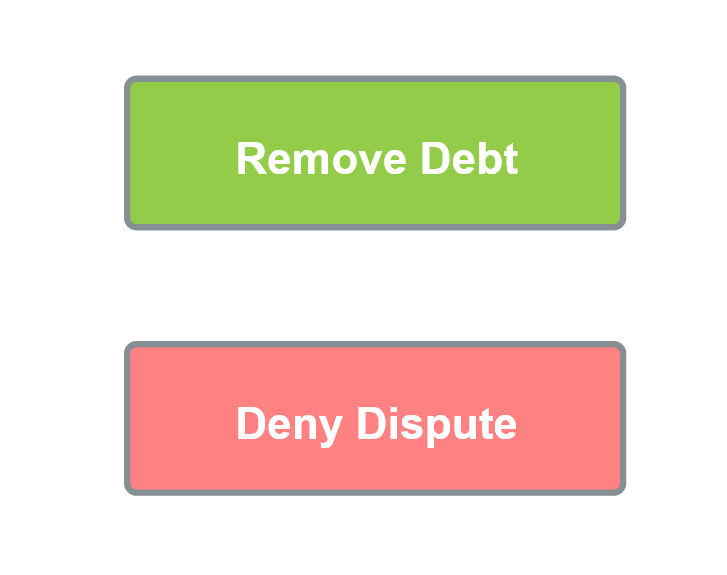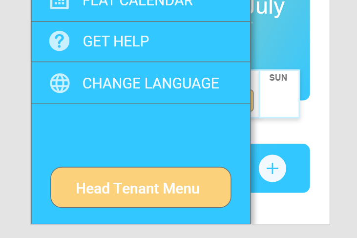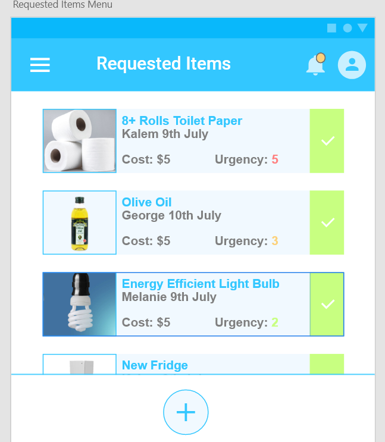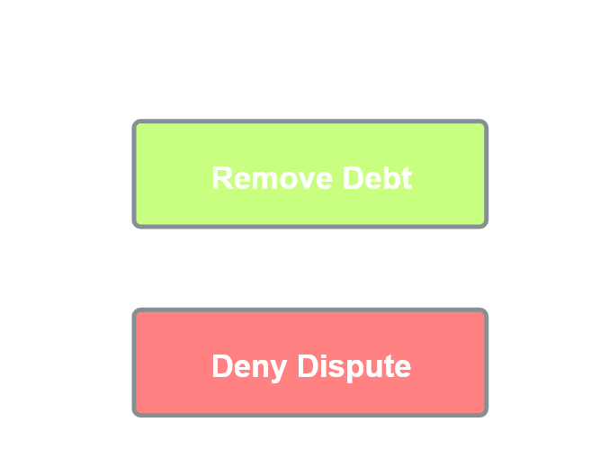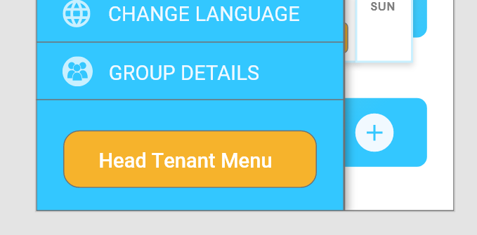

#### **Home page arrow placement.**

On the home page, clicking the arrows to the pie chart and back causes
the arrows to change positions. This was a simple fix just making sure
the arrows were at the same position on the screen. This could be
considered confusing to the users and makes it harder to swap between
the pie chart and flat icon on the home page. So fixing this will cause
less confusion and make it easier to navigate the homepage.

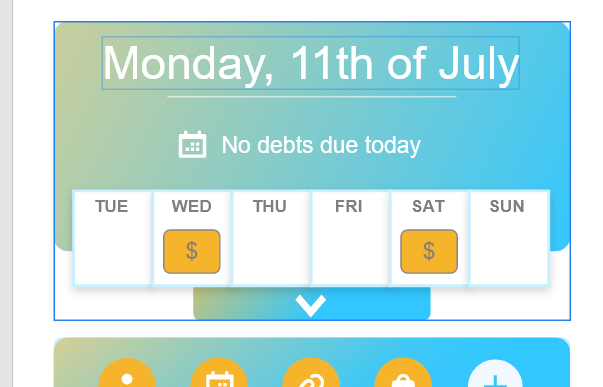

#### **Navigation menu exit**

From the navigation menu, users noted that you should be able to
tap/swipe off the screen rather than needing to tap the back button.
This feature was implemented by having the area to the right of the menu
be able to be swiped or tapped to exit the menu. This is something that
the users expected to occur, so was important to the flow of the
application.

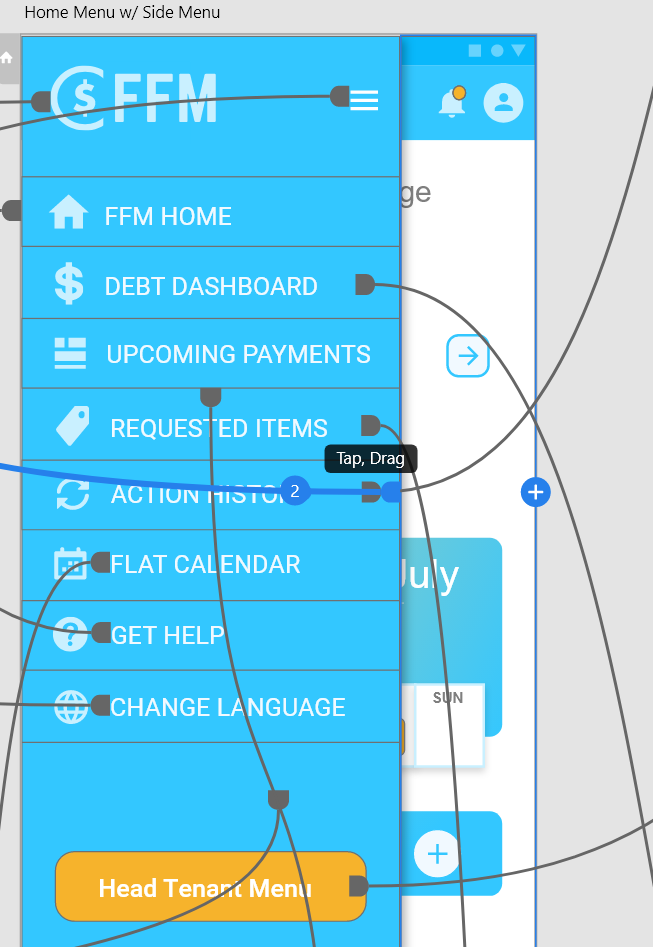

#### **Spelling errors**

Had some minor spelling issues in areas of the prototype such as the
word “Documentation” in the help area. While not a huge usability issue,
the spelling in certain parts of the prototype especially in the help
area is bound to have a negative impact on the user’s impression of the
system. This can be a cause for confusion for someone who has English as
their second language like one of our personas. So fixing these was
beneficial in removing these negative impressions and possible barriers
for users.

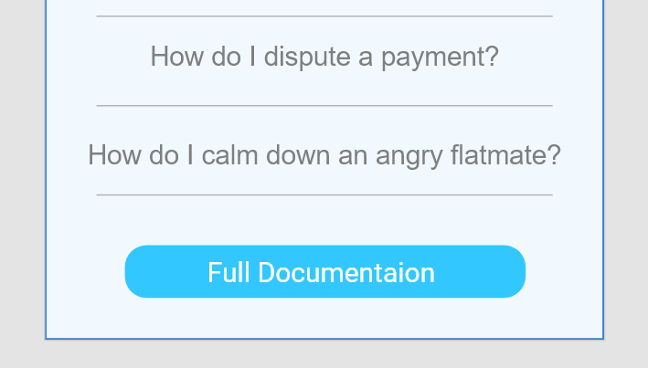

#### **Calendar button**

On the homepage, the button to view the calendar was quite small. This
was made bigger and if you click anywhere on the mini calendar it now
takes you to the calendar page. This was done to make navigation easier
and make it more clear that this was a button that could be pressed to
lead you to the calendar area.

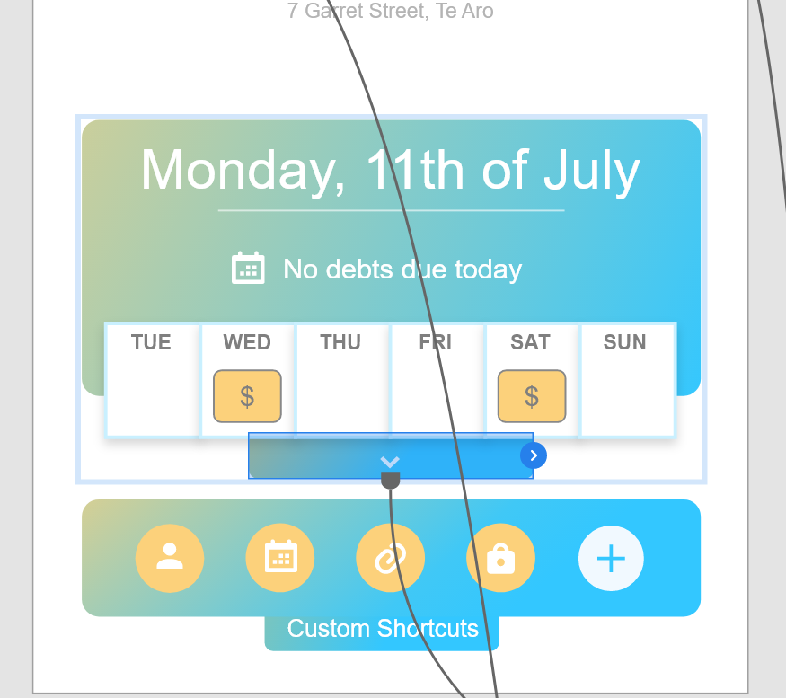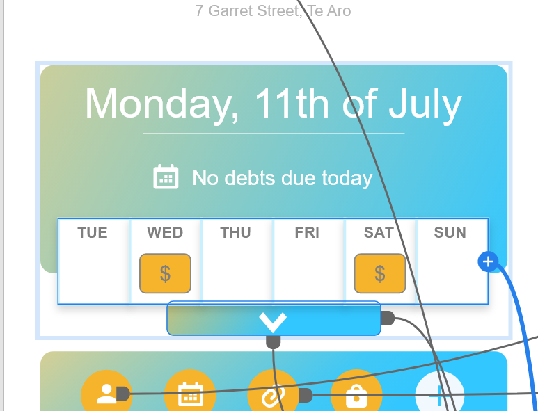

#### **Payment Success Page**

Added a "success" page after payment confirmation pages. Once you've
confirmed you want to make a payment then go to a "payment made
successfully" page. This was implemented to make clear to the user that
a payment has gone through successfully. It was determined that the
payment success page was the most important area that users would want
feedback on whether an action has occurred because making payments is
one of the primary goals for users of the system.

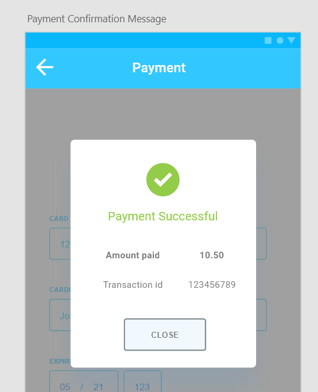

#### **FFM Logo**

This was an issue brought up in testing that the FFM logo in the side
menu for the app should be a pressable button that sends you to the home
screen. This functionality was implemented because it is something many
users would expect to occur.

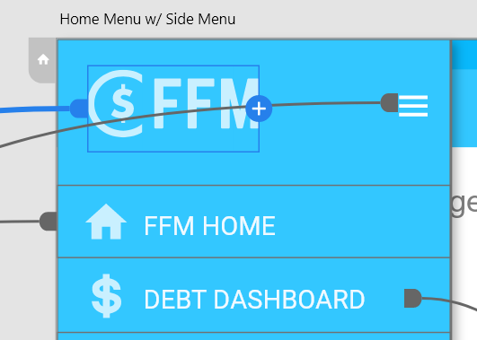

#### **Functionality of All Buttons**

The testers pointed out that there were issues with some of the
buttons. Some had issues where it was hard to test the prototype for a
certain scenario, given a list of buttons, only one worked to show the
result so we added new wireframes (similar to the original prototype,
but with a few changed details and a new linking hierarchy to support
better user testing and flow). We decided to link ALL the buttons in the
prototype, but where buttons pointed to a different item for everything
in a list, we directed that button to a single abstract page to
represent what all buttons in a list of items would lead to. An example
of this is in the debt dashboard for the ‘couch’ item where this is the
abstracted wireframe, and all buttons in the debt dashboard list will
direct to this ‘couch’ item as aside from the certain text and icon
content, this is a representation of what all debt items would look
like. Another example of these many changes was the buttons added to the
notifications menu, where all buttons point to their respective
destinations. Also, some of the sizes of the hitboxes for certain
buttons like the notification bell were increased as they were hard to
press.

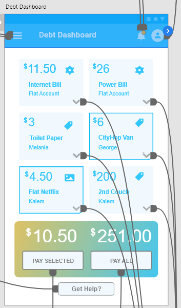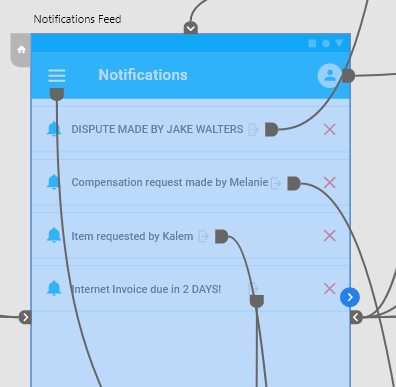

#### **Group Details Page (Home Icon) + New Group/Edit Group Menu**

There was a button (circled red in the image below) on the homepage of
our tested prototype that the testers were confused about, it did not
lead anywhere and needed fleshing out. We had a part in our testing
phase where we asked some questions around the feedback of the testers
to try and flesh out some issues they had and with this particular issue
we agreed that it would be best for this button to lead to a group
details page (as originally intended but unimplemented) where the user
could review the group details. The solution on the prototype was a new
group details page that displays the details of the group, including the
group name, the icon is chosen, the members of the group and a link
(containing their phone number) directly to call them, and a google maps
widget to show the location of the flat. There are buttons at the bottom
that follow the decided on highlighted button colour scheme to show
importance in the actions that can be made in these menus. They point to
the same menu that allows for customization of a group and its details
(with the current details already filled in, but dimmed to show they can
be edited), and another instance of that menu for creating a new group
where the options are the same but the outcome is a new group where the
user is the head tenant. There was also an update on the homepage where
a proper button was placed to direct the user to the group details page,
as well as a button in the side navigation menu. (images of the new
functions are shown below)

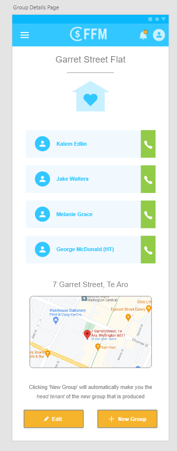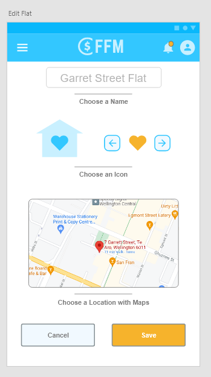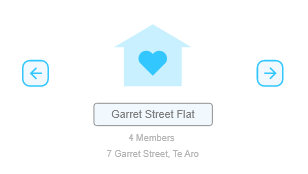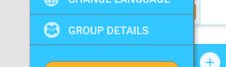

#### **Action History Clarity**

The testers pointed out that in the action history menu, it is unclear
what any of the elements mean. Obviously, there is a help icon that
should lead the user to a quick and easy guide to what the menu does,
but we felt that the testers were right in the fact that there should be
at least a bit of visual guidance to help the user to understand what
they are doing. We changed the action history items to have a
universally recognised ‘undo’ icon to make their functions more obvious,
as well as a title to the page that is more informative and a personal
message at the bottom to clear up the functionality of this page (using
personal message to show that the system is HERE TO HELP and that it is
forgiving and wants the user to make their best/wisest decisions).

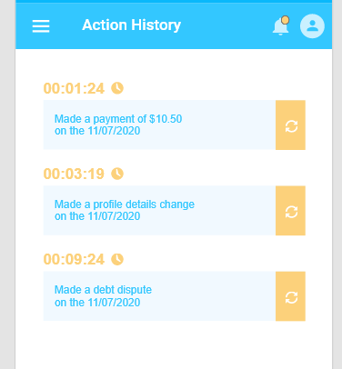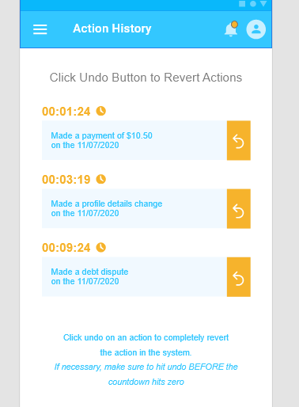

#### **Invoice vs Subscription**

We added a descriptive name to the invoice and subscription buttons to
add clarity to the functions of a new invoice and a new subscription
action, as per the concerns of the testers where they were unsure about
the differences between the two menus. We believed that the two SEPARATE
menus were justified, but just needed a little bit of clarity.

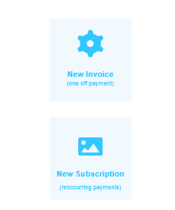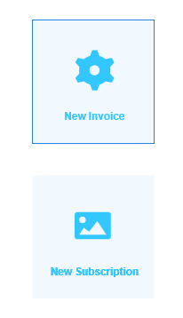

#### **Some Test Concerns we Decided were NOT Issues**

When it came to considering issues that we built from the tester’s
feedback, we decided to not implement the proposed fixes. This is
because in the prototype editor when it came to trying to fix the issues
in the design, we determined these issues were not necessary and impeded
the user-friendliness of the application in our opinions. An example of
this was the head tenant menu button in the side navigation menu. One
tester (our head tenant) found that the head tenant menu button was
disruptive and out of place with the other menu items. We decided to
keep it the way it was because we believe a head tenant menu carries a
lot of significance within the app system and that it should stand out
as it carries important responsibility and is only viewable by one
member of the group, so it should not be integrated with the other
options like the tester suggested. Another instance of this was the
subscription vs invoice concern from the testers (which is detailed
above) where we had feedback that involved potential solutions that we
thought were not necessary. We instead opted to add a descriptive text
instead of combining the two menus or relabelling everything because we
believe that the two menus do completely different things and are both
important to the head tenant functions.

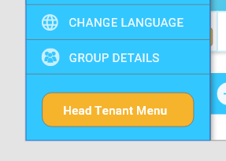

### **User Testing Discussion**

Testing was incredibly beneficial for our group as it allowed us to get
a completely fresh perspective on the system. This was valuable as it
revealed that we had made many oversights in the design. Because we had
become so familiar with the system as we developed it, we began assuming
that new users would automatically understand both simple and complex
interactions with the system. We found that many of the essential use
cases were presented well to the users and were easily accessible, but
there were small nuances with them that made it difficult for the user
to fully understand what they were doing. There were also aesthetic
design choices such as colour and icons that we did not realise would be
impeding or confusing the usage of the system.

For example, when setting the alert time on an invoice the testers were
unsure of the function of the alert time, and as such had trouble with
using them. This was because as developers, we understood exactly how
the system worked and what each function was meant to do, and we then
designed the system based on this assumption that all users would have
the system knowledge we had. However, this was not the case and setting
the alert time became a very confusing and difficult task for the
testers as it was not obvious exactly what setting the alert time would
result in.

Another example is the colour of the cancel button in confirmation
boxes. We had these designed with a yellow/ orange colour, but it was
mentioned in testing that these colours did not give a good
understanding of what this button would do. This occurs because during
development, we knew what this button would do, so we only considered
the colour based on it matching the rest of the design, not its actual
function. However, because the testers had never used the system and did
not understand, not having this button in a colour corresponding to its
function meant the tester did not understand the true function of
pressing this button.

Testing also allowed us to see how people approached the system when
first using it. This was important to see because as the developers,
this is an insight we could not have gathered ourselves. As mentioned
above, this showed us what navigational tasks and functions were not
obvious when first using the system.

The most significant result from testing was the overall streamlining
and simplification of our system. From the testing, we were able to fill
in many holes that were in the user experience that we had overlooked in
development. For example, clicking the logo should take you back to the
home screen. This relatively simple action is something that most users
would expect but was very easy for us to overlook as it did not come up
in our use cases or scenarios. However, it makes the system much more
streamlined and satisfies an expectation most users would have. Also, as
mentioned above, many of the use cases relied on an assumption that the
user already had some system knowledge. Testing revealed these
assumptions and made us redesign some of the key functions within the
system to simplify them. These simplifications involved helpful text
boxes with personal messages to guide the user without having to click
on the help button, more intuitive icons to simplify and express what
each button does, better button linking, and additional wireframes to
support different functionalities (for testing).

# Prototype

[prototype.xd](prototype.xd)

[Viewable Link](https://xd.adobe.com/view/19c36e19-b294-420e-83db-86222154173f-4c90/?fullscreen&hints=off)

# Video 

[Watch the video here](Flat_finances_video.mp4)
