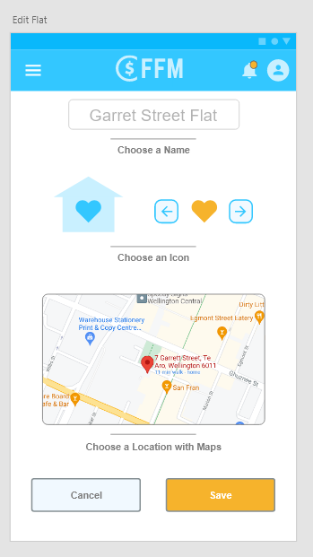
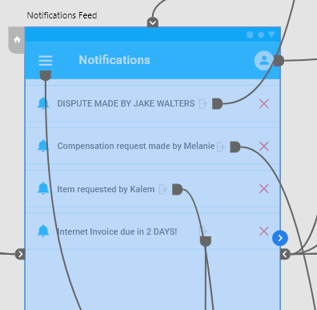

# flat-finances-ux

A collaborative university project in which user experience design principles were strictly applied to a prototype for a flat finance management app.

I played a vital role in the project by supplying the work in justifying design choices to align with user experience principles like Jakob Nielsen's heuristics. I also lead the team in designing the wireframes making sure the prototype covered all functionalities and intended user experience aspects. I also created the video to cover the prototype and its functionalities/design choices in under 5 minutes.
  

### The team consisted of 6 students from Victoria University of Wellington

- Kalem Edlin ( myself ) edlinkale@ecs.vuw.ac.nz
- Ghattas Farah farahghat@ecs.vuw.ac.nz
- Nicola Hallberg hallbenico@ecs.vuw.ac.nz
- Tomas Lieffering lieffetoma@ecs.vuw.ac.nz
- Josh Saxton saxtonjosh@ecs.vuw.ac.nz
- Brandon Williams williabran@ecs.vuw.ac.nz
    

# Prototype

[prototype.xd](prototype.xd)

[Viewable Link](https://xd.adobe.com/view/19c36e19-b294-420e-83db-86222154173f-4c90/?fullscreen&hints=off)
  

# Video

[Watch the video here](Flat_finances_video.mp4)
  

# Screenshots

